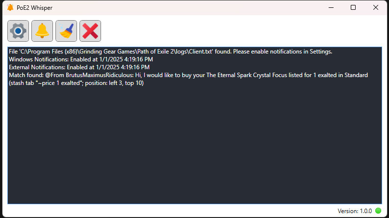
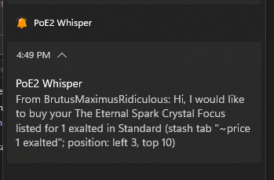
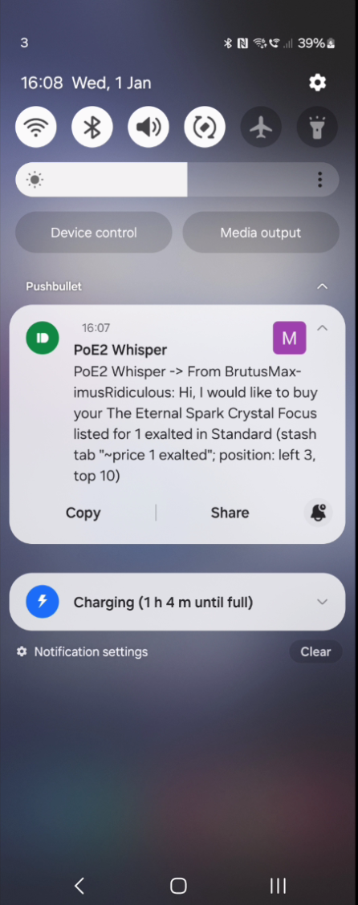
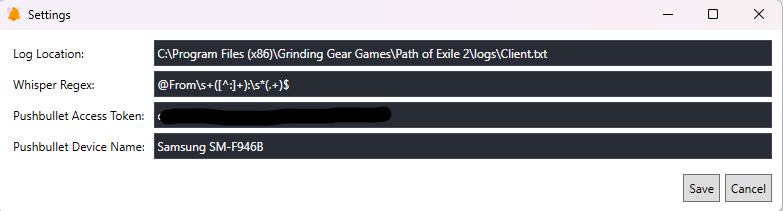

# PoE2 Whisper

- This is a.net8 application that notifies on any incoming PoE whispers. It is published as self-contained hence does not require .net runtime to be installed on the device

At the moment it supports
- Windows notifications 

- Phone push notifications via Push bullet service 

How to setup Pushbullet service
 - Login with your google account
 - Navigate to My Account -> Settings -> My Tokens and generate a token 
 - Install Pushbullet app in your phone and login with the same google account
 - Use phone name from My Account -> Settings -> Devices together with the token in the Settings page
 